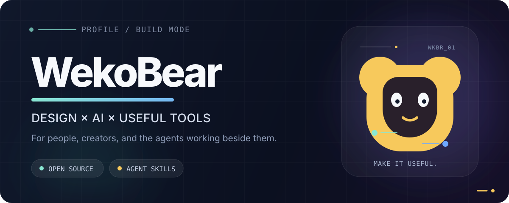

  

  <a href="https://github.com/wekobear?tab=repositories">Projects</a> ·
  <a href="https://github.com/wekobear?tab=stars">Stars</a> ·
  <a href="https://github.com/wekobear?tab=followers">Follow</a>

## Hi, I'm WekoBear 👋

I turn repeatable design, creator, and research workflows into practical open-source tools and Agent Skills.

我把设计、内容创作和研究中的重复工作，做成可以直接使用、持续迭代的开源工具。

`AI agent workflows` · `Design systems` · `Local-first tools` · `Creator automation`

## Selected work

| Project | What it does |
| --- | --- |
| **[Daily Jokes](https://github.com/wekobear/daily-jokes)** | A configurable Agent Skill that creates five structurally different short jokes, with optional current-trend research and comic generation. |
| **[Kill Skill — WekoBear](https://github.com/wekobear/kill-skill-wekobear)** | A visual triage workflow for auditing, keeping, archiving, and migrating Agent capabilities across different coding assistants. |
| **[Independent Site Inspector](https://github.com/wekobear/independent-SiteInspector-skill)** | A reusable audit Skill for finding evidence-backed conversion problems across DTC, Shopify, and independent commerce sites. |

## Open-source projects in my toolkit

I also keep working forks of tools I use and study. The original maintainers are linked in each repository.

| Project | Focus |
| --- | --- |
| **[Reicon](https://github.com/wekobear/reicon)** | An open-source icon library for designers and developers. |
| **[Open Design](https://github.com/wekobear/open-design)** | A local-first design workbench that turns coding agents into a practical design engine. |
| **[WeChat Intelligence Hub](https://github.com/wekobear/wechat-intelligence-hub)** | A local-first system for searchable chat history, briefings, follow-ups, and opportunity tracking. |
| **[WeChat Publisher](https://github.com/wekobear/wechat-publisher)** | A workflow for turning Markdown and source material into reviewable WeChat Official Account drafts. |

## Find me here

Explore everything in **[my repositories](https://github.com/wekobear?tab=repositories)**. For a project-specific question or idea, open an issue in the matching repository.

  Build useful things. Keep the workflow clear.

